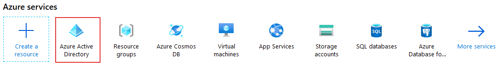
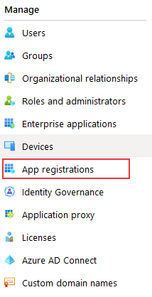
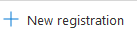
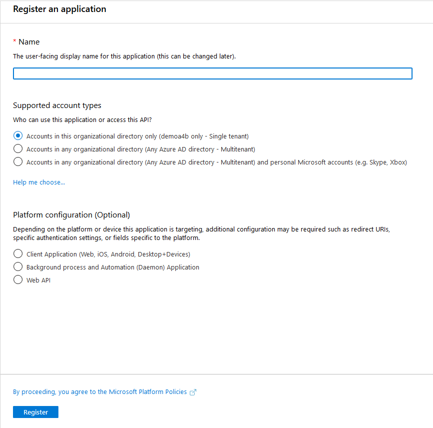
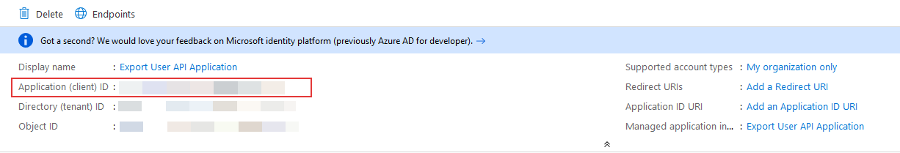
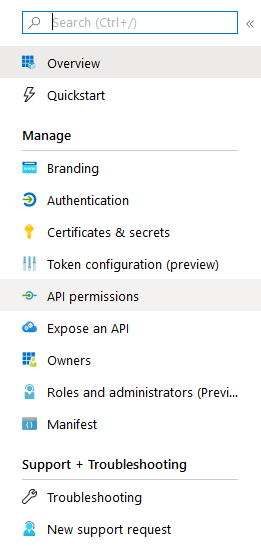
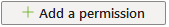
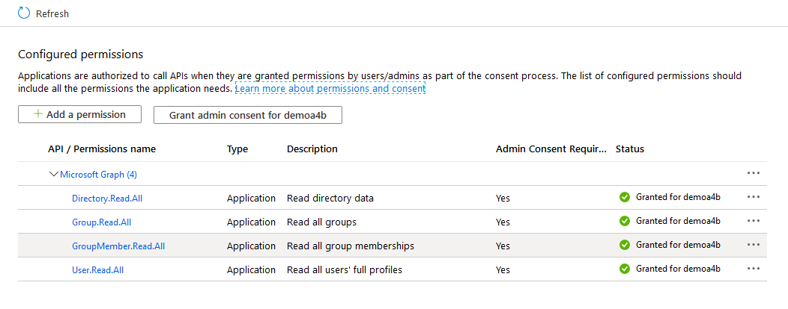
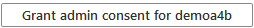

#  Build An Alexa for Business Active Directory import function

1.  **Go to the [Azure Active Directory Portal](https://portal.azure.com).  In the top-right corner of the screen, click the "Sign In" button.**
(If you don't already have an account, you will be able to create a new one for free.)

2. Once you have signed in, move your mouse over the **Azure Active Directory** text located under the Azure services section and click to enter.

    

3. From the **Microsoft Azure Active Directory console** select the **App registrations** link at the left center side of the screen.

    

4. Click on the **+ New registration** button.

    

5. In the **Register an application** screen, enter a name for the app. Example: **A4B User and Group Import Application**.

6. Select **Accounts in this organizational directory only (Single tenant)** for the Supported account types.

    

7. Click on the **Register** button near the bottom left side of the screen. The app registration is created and the **Overview** page displays.

8. Copy the **Application ID** for use in your AWS Lambda function. This value is also referred to as the Client ID.

    

9. Next to generate a client secret, select the **Certificates & secrets** page. Select **New client secret**.

10. Provide a **description** for the secret, and an **expires** duration.

11. When done, select **Add**. The value of the secret displays. **Copy and save this value in another location**, becuase you can't retrieve it later. 
     You will provide the secret with the Application ID in your AWS Secrets Manager for the AWS Lambda function to use later.

12. Next to add permissions, select the **API permissions** page. 

    

13. By default the **User.Read** permission from **Microsoft Graph** is listed. Select the **...** to the far right of the **User.Read** entry and select **Remove permission**.
     Select **Yes, remove** in the Remove permission popup.

14. Click on the **Add a permission** button, select the **Microsoft Graph** API.

     

15. In the Microsoft Graph Request API permission screen, select the **Application permissions** box.

16. In the Application API listing, select the following permissions: **Directory.Read.All, Group.Read.All, GroupMember.Read.All, User.Read.All**.

    

17. Once you have selected the approrpiate permissions, click on the **Add permissions** button.

18. Next, we need to grant admin consent for the permission added. Select **Grant admin consent for tenant**. Where tenant is the name of your tenant.
     Select **Yes** on the grant admin consent popup page.

    

