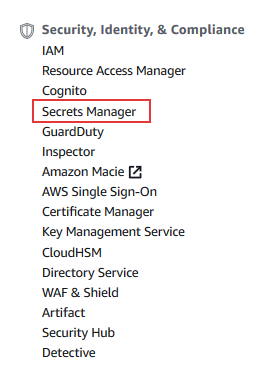
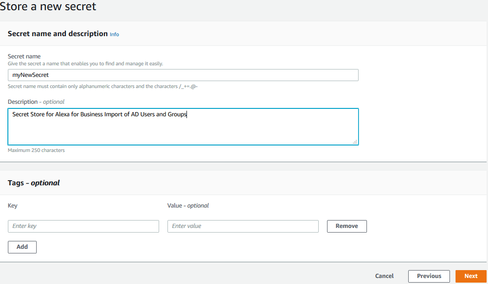

# Build An Alexa for Business Active Directory import function

## Setting Up A AWS Secrets Manager secret store Using Amazon Web Services

On [first step of this guide](./1-ad-app-registration.md) of this guide, we registered an application in Active Directory and were provided an ApplicationId and Client Secret that had specific permissions.  On this page, we will be creating an AWS Secrets Manager secret store using [Amazon Web Services](http://aws.amazon.com). You can [read more about what a secret store is](https://aws.amazon.com/secrets-manager/), but for the purpose of this guide, we will step you through creating a secret store to store the ApplicationId and Client Secret securely and allow AWS Lambda to be able to collect that information securely.

1. **Go to http://aws.amazon.com and sign in to the console.** If you don't already have an account, you will need to create one.  [If you don't have an AWS account, check out this quick walkthrough for setting it up](https://github.com/alexa/alexa-cookbook/tree/master/aws/set-up-aws.md).

    

2. **Select Secrets Manager service from under the Security, Identity, & Compliance section.**.

    

3. Click on the **Store a new secret** button.

    

4. In the **Select secret type**, select **Other type of secrets**.

5. In the **Specify the key/value pairs to be stored in this secret**, enter the following:
    * key: applicationId, value: **Application Id** from your App Registration in the first section
    * key: clientSecret, value: the **client secret** from your App Registration in the first section

6. Ensure that **DefaultEncryptionKey** is selected in the **Select the encryption key**. 

    

7. Click **Next**.

8. In the **Secret name and description** screen, enter the **Secret name** and a **Description**
    Take note of the **Secret name**, you will need this for the AWS Lambda function environment variable later.

    

9. Click **Next**.

10. Select **Disable automatic rotation** in the **Configure automatic rotation**.

    

11. Select **Next**.

12. In the **Store a new secret** screen, scroll down to the bottom of the screen and click on the **Store** button.

