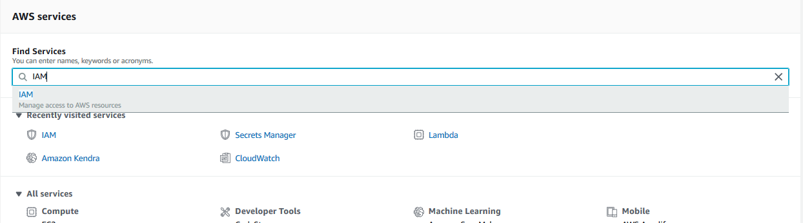
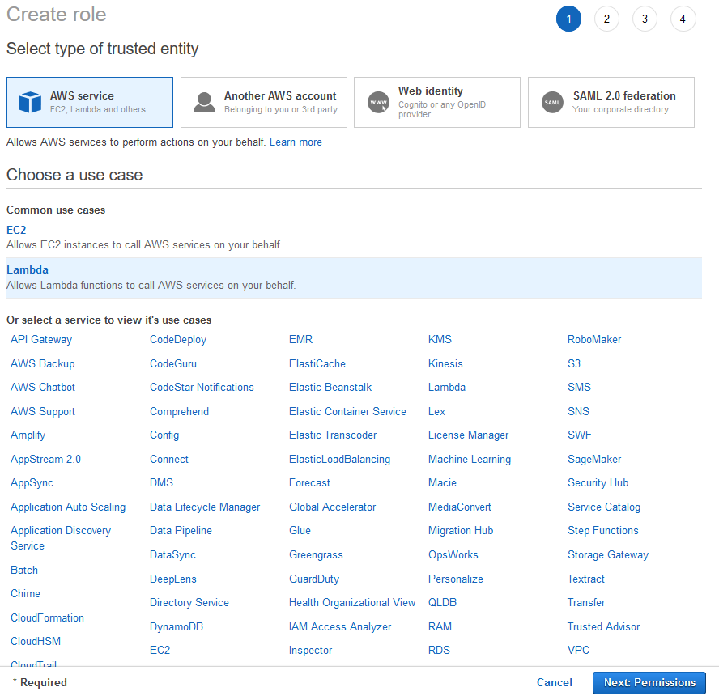
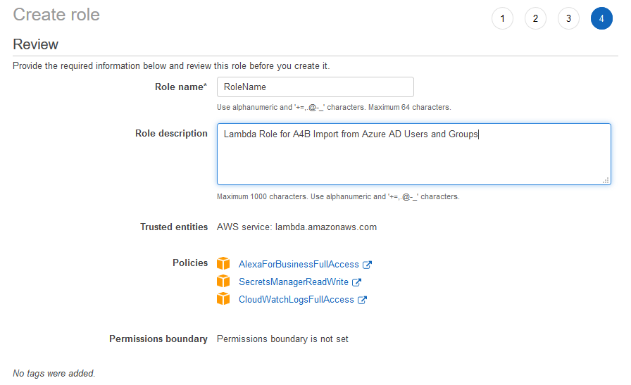

# Build An Alexa for Business Active Directory import function

## Setting Up An IAM Role Using Amazon Web Services

In the [first step of this guide](./1-ad-app-registration.md), we created the App registration with applicationId and client secret. We then created the secret store(./2-secrets-manager.md) to securely store our applicationId and client secret  On this page, we will be creating an IAM Role for our Lambda function.

1.  **Go to http://aws.amazon.com and sign in to the console.**

    

2.  **Click "Services" at the top of the screen, and type "IAM" in the search box.**  You can also find IAM in the list of services.  It is in the "Security, Identity, & Compliance" section.

    

3.  Click on **Roles** in the left hand side.  Then click on the **Create role** button to start creating a new role that we will use with our Lambda function.

4.  Under **Select type of trusted entity**, select **AWS service**.  

5.  Under the **Choose a use case**, select **Lambda**. Click on the **Next: Permissions** button at the bottom of the page.

    

6.  For permissions, select the folloing **Policy name** entities by placing a check mark in the box next to the name:
    * **AlexaForBusinessFullAccess**,
    * **SecretsManagerReadWrite**,
    * **CloudWatchLogsFullAccess**

7. Click on the **Next: Tags** button at the bottom of the page.

8. On the **Add tags (optional)** page, click on the **Next: Review** button at the bottom of the page.

9. In the **Review** page, **enter a Role name and Role description**. Note the Role name, as you will need this for yourt lambda function.
    Ensure that the follwoing is shown:
        Trusted entities: **AWS service: lambda.amazonaws.com**
        Policies: **AlexaForBusinessFullAccess, SecretsManagerReadWrite, CloudWatchLogsFullAccess**    

    

10. Click the **Create role** button to create the role.

