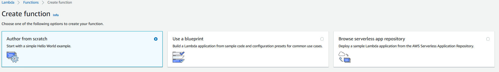
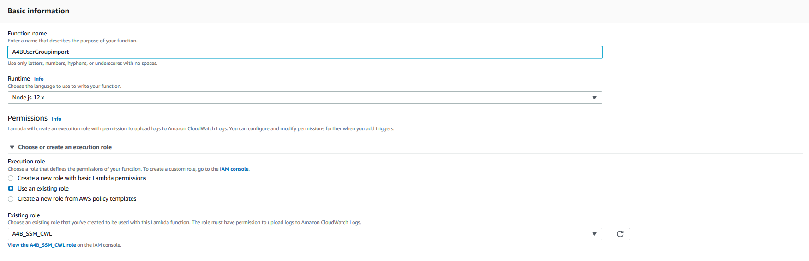
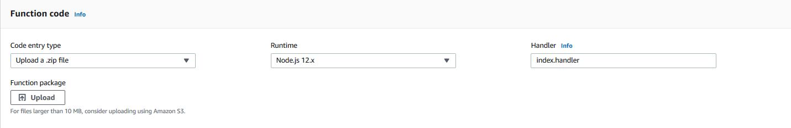
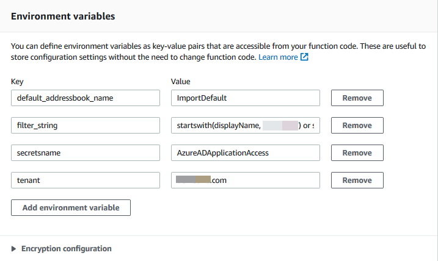

# Build An Alexa for Business Active Directory import function

## Setting Up A Lambda Function Using Amazon Web Services

In the [first step of this guide](./1-ad-app-registration.md), we created the App registration with applicationId and client secret. We then created the secret store(./2-secrets-manager.md) to securely store our applicationId and client secret  On this page, we will be creating an AWS Lambda function using [Amazon Web Services](http://aws.amazon.com).  You can [read more about what a Lambda function is](http://aws.amazon.com/lambda), but for the purposes of this guide, what you need to know is that AWS Lambda is where our code lives.  When AWS CloudWatch events kick off, it is our AWS Lambda function that runs the request, and provides the data to Alexa for Business Directory.

1.  **Download or Clone the repository to yout local drive.** If you downloaded the zip file, unzip the file.

2.  **Ensure you have node.js installed on your pc.**

3.  **Open a node command prompt, navigate to the directory named active-directory-import that you cloned are downloaded and unzipped.** 

4.  **Run the command 'node' in the command prompt. Next, run the command 'npm update'**

5.  **Zip the contents of the active-directory-import folder.**

6.  **Go to http://aws.amazon.com and sign in to the console.**

    

7.  **Click "Services" at the top of the screen, and type "Lambda" in the search box.**  You can also find Lambda in the list of services.  It is in the "Compute" section.

    

8.  **Check your AWS region.** AWS Lambda only works with the Alexa For Business in these regions: US East (N. Virginia).  Make sure you choose the region closest to your customers.

    

9.  **Click the orange "Create function" button.** It should be near the top of your screen.  If you don't see this button, it is because you haven't created a Lambda function before.  Click the blue "Get Started" button near the center of your screen.

     

10.  There are three boxes labeled "Author from scratch", "Use a blueprint" and "Browse serverless app repository". **Click the radio button in the box titled  "Author from scratch"**.

      

11.  Enter the following **Basic information** to start creating the Lambda function:
    **Function name**: A4BUserGroupImport
    **Runtime**: Node.js 12.x
    **Permissions**: Use an existing role
    **Existing role**: The name you gave for the IAM role you created earlier

     

12. **Click on the Create function button** at the bottom of the page.

    

13. In your function page, navigate down to the **Function code** section, select the **Code entry type** to be Upload a .zip file.
    Click on the **Upload button** and select the Lambda function zip file you downloaded from this github location, on your local pc.

    

14. Click the **Save button** at the top of the screen to peform the upload.

    

    **Note**: The file is larger than 10 Megs , so you will see a message displayed as: The deployment package of your Lambda function "A4BUserGroupImport" is too large to enable inline code editing. However, you can still invoke your function. This is normal and the function has been loaded.

15. Navigate further down to the **Environment variables** section. Enter the following variable keys and values for importing user and group information by groups:
    * Key: **default_addressbook_name**, Value: **Default**
    * Key: **secretsname**, Value: the name of the secret store you created easrier in your AWS Secrets Manager.
    * Key: **tenant**, Value: the tenant name of your Active Directory service.
    * Key: **filter_string**, Value: this is a filter you create to define what to collect from Groups.

        Example: **startswith(displayName, 'DeveloperGroup') or startswith(displayName, 'SalesGroup')** 
        For more information on using filters with [Microsoft Graph](https://docs.microsoft.com/en-us/graph/query-parameters#filter-parameter). 

    **NOTE:** There are more optional settings on how you wish to import. Below are the other settings that you can use:

    * Key: **authorityHostUrl**, Value: Url to perform authentication, **Default**: https://login.microsoftonline.com
    * Key: **create_address_book**, Value: Allow lambda function to create address books (0/1), **Default**: 1
    * Key: **create_address_book_by_field**, Value: use value from specific field to create address book name from user or group data, **Default**: displayName
    * Key: **use_groupname_for_addressbook**, Value: if importing by groups, use the group name as the address book name, otherwise query by user (0/1), **Default**: 1
    * Key: **use_groups**, Value: query by group instead of user (0/1), **Default**: 1
    * Key: **debug**, Value: enable/disable debugging (0/1), **Default**: 0

    

16. Click the **Save button** at the top of the screen.

        

17. Navigate to the **Basic settings** section, click on the **Edit button**.
    * Enter a **description** for your AWS Lambda function and set the **Timeout to 30 seconds**.

18. Click on the **Save button**.

    

