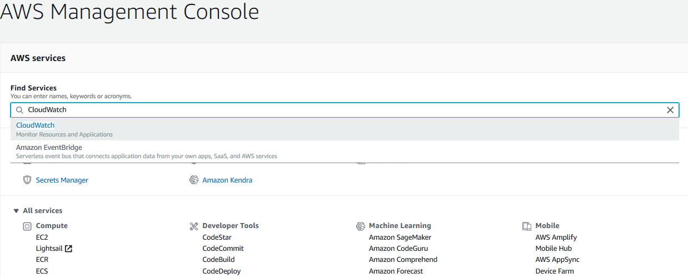
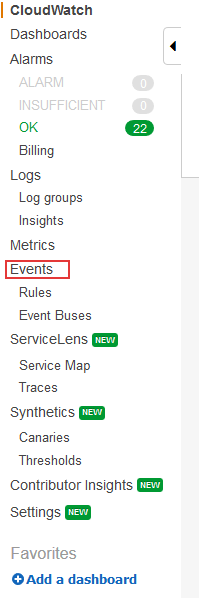
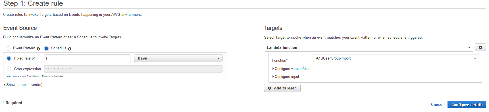
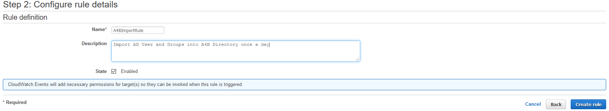

# Build An Alexa for Business Active Directory import function

## Setting Up A AWS CloudWatch Event Using Amazon Web Services

At this point, you should have a working copy of our A4B import of AD Users and Groups function.  In order to make it automated, you will need to create an AWS CloudWatch event to kick off the AWS Lambda function on a daily basis.  Here are the things you will need to do:

1. **Go to http://aws.amazon.com and sign in to the console.** 

    

2. **Click "Services" at the top of the screen, and type "CloudWatch" in the search box.**  You can also find CloudWatch in the list of services.  It is in the "Management & Governance" section.

    

3. **Click "Events" link on the left side of the screen.** Then click the **Get started** button.

    

4. Click the **Get started** button.

    

5. In the **Step 1: Create rule** screen, select "Schedule" under the **Event Source** section.
    Set the **Fixed rate of** to 1 for duration and type to Days.

6. Under the **Targets** section, click on the **Add target** button.

7. Ensure the drop down shows **Lambda function** for the target.

8. Search for the **Function** named "A4BUserGroupImport" in the drop down.

    

9. Click on the **Configure details** button.

10. In the **Step 2: Configure rule details** screen, enter a Name and Description for the timed event. Click on the **Create rule** button to complete the rule.

    

**Note** at this point the rule will be active and start running the import process!

