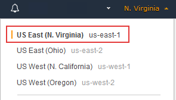
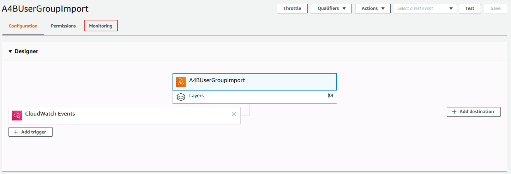

# Build An Alexa for Business Active Directory import function

## Verifying your AWS Lambda function with Alexa for Business

So far, we have [created an App Registration](./1-ad-app-registration.md), [a secrest store](./2-secrets-manager.md), [a iam role](./3-iam-role.md), [a lambda function](./4-lambda-function.md) and [connected them together with a cloudwatch event](./5-cloudwatch-event.md).  Your Lambda function is now running, so lets check the log.

1.  **Go to http://aws.amazon.com and sign in to the console.** 

    

2.  **Click "Services" at the top of the screen, and type "Lambda" in the search box.**  You can also find Lambda in the list of services.  It is in the "Compute" section.

    

3.  **Check your AWS region.** AWS Lambda only works with the Alexa For Business in these regions: US East (N. Virginia).  Make sure you choose the region closest to your customers.

    

4. Select **Functions** on the top left hand side, then scroll down your Functions to find the one you named "A4BUserGroupImport".

5. Click on the function named: **A4BUserGroupImport**.

6. To ensure your Trigger is enabled, select the Trigger named **CloudWatch Events/EventBridge**, then navigate down to the **CloudWatch Events/EventBridge** section and select **Enabled** for the trigger to be active.

7. Once in the A4BUserGroupImport function, select the **Monitoring** link located near the top right hand side just under the name "A4BUserGroupImport".

        

8. In the Montoring section, click on the **View logs in CloudWatch** button.

       

9. In the **CloudWatch  >  Log Groups > Streams for /aws/lambda/A4BUserGroupImport**, you should see at least on entry. Click on the one entry to see the log output.

10. Look over the log entries. You may see some warnings that indicate a contact was not imported due to missing contraints. Pay attention to errors as they are specific to failed attempts to authenticate,
    collect users and groups, or assign to Alexa for Business Directory.

11. An example might look like this:

        START RequestId: 570b7b9e-9f29-4671-9a94-96d897884a68 Version: $LATEST
        2020-02-12T20:33:00.919Z	570b7b9e-9f29-4671-9a94-96d897884a68	WARN	Failed contact,  Missing the following field: FirstName for contact: DanDemoRoom
        2020-02-12T20:33:02.221Z	570b7b9e-9f29-4671-9a94-96d897884a68	INFO	Updated existing contact:  Test User
        2020-02-12T20:33:02.789Z	570b7b9e-9f29-4671-9a94-96d897884a68	INFO	Contact: Test User associated with Address Book:  Tester
        2020-02-12T20:33:04.085Z	570b7b9e-9f29-4671-9a94-96d897884a68	INFO	Updated existing contact:  Marcello Giant
        2020-02-12T20:33:04.699Z	570b7b9e-9f29-4671-9a94-96d897884a68	INFO	Contact: Marcello Giant associated with Address Book:  Giant
        2020-02-12T20:33:05.914Z	570b7b9e-9f29-4671-9a94-96d897884a68	INFO	Updated existing contact:  Dan Man
        2020-02-12T20:33:06.182Z	570b7b9e-9f29-4671-9a94-96d897884a68	INFO	Contact: Dan Man associated with Address Book:  Giant
        2020-02-12T20:33:07.539Z	570b7b9e-9f29-4671-9a94-96d897884a68	WARN	Failed contact,  No PhoneNumber or SipAddress defined, you must have at least one for contact: Andy Joy
        2020-02-12T20:33:08.636Z	570b7b9e-9f29-4671-9a94-96d897884a68	WARN	Failed contact,  No PhoneNumber or SipAddress defined, you must have at least one for contact: Sean Manson
        2020-02-12T20:33:09.636Z	570b7b9e-9f29-4671-9a94-96d897884a68	INFO	Completed import of users and groups